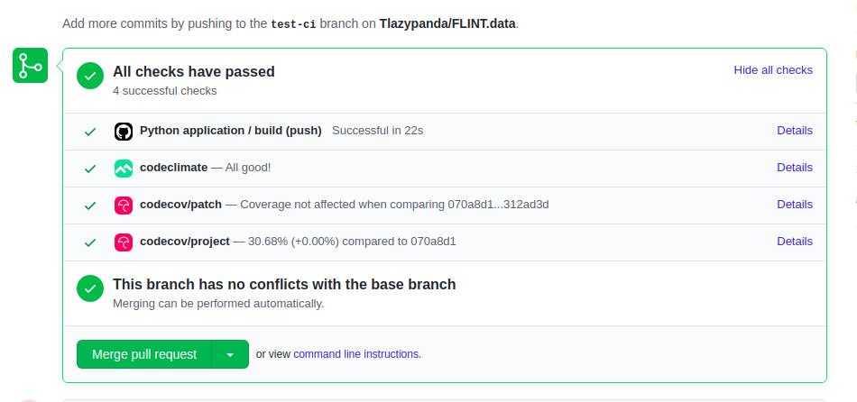
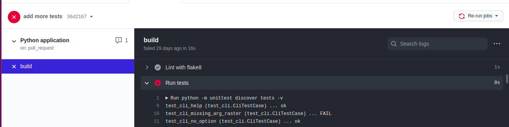
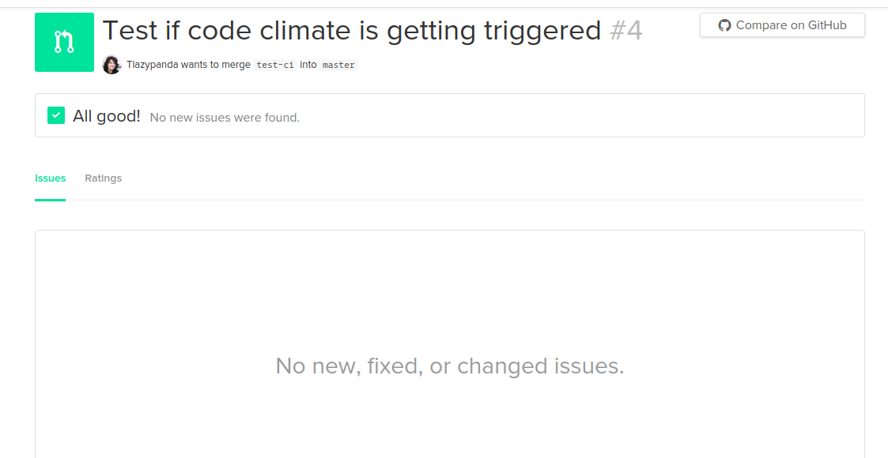

.. _DeveloperWorkflow:

Automated Checks for pull requests
==================================

In order to maintain the code quality and coverage of our repositories,
moja global deploys a series of tools. These tools include our
Continuous Integration Setup that runs a complete test suite, Automated
Code quality checks as well as Coverage tracking tools.

This section focuses on how these automated tests are set up and how they can
be configured on our GitHub repositories. Currently only the
following checks are available in our `FLINT.data_processing`_
repository.

Continuous Integration
----------------------

moja global uses `GitHub Actions`_ for Continuous Integration. GitHub
Actions creates an environment based on the Operating System of your
choice (Linux in our case) and runs our test suite. This Continuous
Integration script is triggered by every pull request and only passes
when all the tests run successfully. This script also uploads our
coverage report to `Codecov`_ for tracking the coverage compared to our
base coverage percentage.

-  In order to view the pull request build, please click on the
   **Details** link of the ``Python application / build (push)`` tab.

   GitHub pull request Checks

-  In the case where tests fail, we can debug the problem from going
   through the console output as displayed here.

   GitHub actions Pull Request Build Console

-  After analysis of the test failure, you can then try to debug the
   test locally as well by running the command:

::

   python -m unittest discover tests -v

-  Sometimes tests may also fail if your pull request is not rebased to
   the latest master. So it is recommended to complete a rebase before
   creating the pull request.
-  If you are still facing issues with test failure, please reach
   out to the maintainers of the repository.

Code Coverage Check
-------------------

moja global uses `Codecov`_ as a tool for tracking coverage of our
application. As mentioned above, the Continuous Integration script
uploads the coverage report to Codecov. Codecov then compares the
coverage percentage to that of our base pull request and asserts if the
Code coverage has increased/decreased. After evaluation, the CodeCov bot
comments on the pull request with the details of our pull request
coverage.

If the coverage percentage remains the same or higher than before, the check
passes. Otherwise if the percentage is lower, the check fails.

-  In order to debug and understand the failure of this check you may
   click on the **Details** tab of the ``codecov/project`` check under
   the Checks tab.

.. _FLINT.data_processing: https://github.com/moja-global/FLINT.Data_Preprocessing
.. _GitHub Actions: https://github.com/features/actions
.. _Codecov: https://about.codecov.io/

Code Quality Check
==================

moja global currently uses `Codeclimate`_ as our Code Quality tool.
Codeclimate is a third-party tool that provides automated code reviews
on every pull request for better code maintainability. If any lines of
code can be improved according to the programming convention, then the
check fails providing detailed information on whichever segments of the
code that need to be modified.

-  In order to find the Codeclimate check, please click on the
   **Details** link of the ``codeclimate`` tab.

   GitHub pull request Checks

-  This will redirect you to the detailed report on the issues that
   needs to be fixed on the codeclimate dashboard. You may also view
   other files in your code here to check the code quality. The check
   below depicts the scenario where no issues are found in your code and
   the code is ready to be merged!

   Codeclimate Dashboard

-  After debugging issues (if any) in the previous step and modifying
   the pull request, Codeclimate will automatically check again against
   the latest changes.

.. _Codeclimate: https://codeclimate.com/
