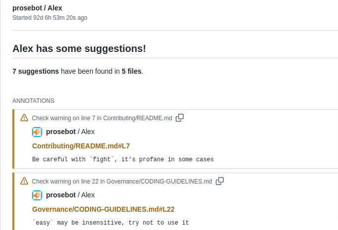
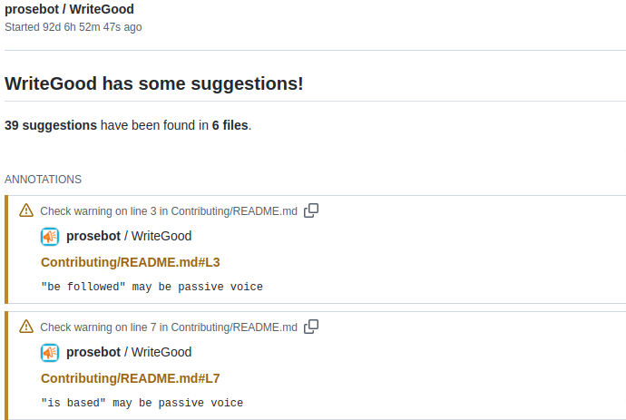
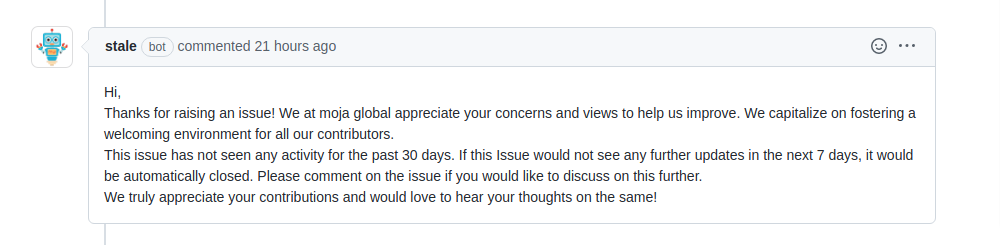
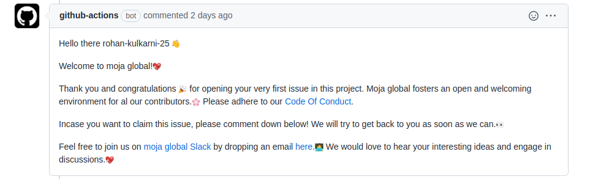

.. _DeveloperWorkflow:

Bots and Integrations
=====================

moja global makes use of an array of bots and integrations with GitHub
in order to provide a smooth experience to new contributors and to also
make the process of contributing as effortless as possible.

This section focuses on the bots used within the organization and how to
maintain them.

All-contributors Bot
--------------------

**All-contributors** bot is a `GitHub bot`_ to automate acknowledging
contributors to your open source projects. This is achieved by setting
up a contributors table in the readme which is edited according to the
commands given to our bot. This bot is created and maintained by the
all-contributors organisation `here`_.

**Usage**
~~~~~~~~~

\* **Add a contributor** : Comment on Issue or Pull Request, asking
@all-contributors to add a contributor: :

::

   @all-contributors please add <username> for <contributions>

   * <contribution> : See the `Emoji Key (Contribution Types Reference) <https://allcontributors.org/docs/en/emoji-key>`_ for a list of valid contribution types.

-  **Intent-Based Bot** : Your request to the bot doesn't need to be
   perfect. The bot will use basic Natural Language Parsing to determine
   your intent. For example, this will work too:

::

   Jane you are crushing it in documentation and your infrastructure work has been great too. Let's
   add jane.doe23 for her contributions. cc @all-contributors``

-  The bot will then create a Pull Request to add the contributor, then
   reply with the pull request details.

Contributing
~~~~~~~~~~~~

If you wish to configure or modify the bot settings according to the
needs of the repository, you may update the ``.all-contributorsrc`` JSON
file. The data used to generate the contributors list will be stored in
there, and you can configure how you want ``@all-contributors`` to
generate the list. Here are more details on the `configuration options`_
available.

.. _GitHub bot: https://github.com/login?integration=allcontributors&return_to=%2Fapps%2Fallcontributors%2Finstallations%2Fnew
.. _here: https://github.com/all-contributors/all-contributors
.. _configuration options: https://allcontributors.org/docs/en/bot/configuration


Prose Bot
--------------------
**ProseBot** is a `Github Bot <https://github.com/login?integration=prosebot&return_to=%2Fapps%2Fprosebot%2Finstallations%2Fnew>`__. As changes are made to Markdown files (.md)
or text files (.txt) it runs various checks against them to give
feedback regarding the language usage. This bot is created and maintained by the prosebot ​organization
`here <https://github.com/prosebot/prosebot>`__.

**Usage**
~~~~~~~~~

Currently, the app runs the following checks:-

-  Correct spelling (and provides possible corrections).
-  Use of non-inclusive/profane/offensive language.
-  Various prose-related checks, find the full list `here <https://github.com/btford/write-good>`__.

Here's how it looks in action:



   ProseBot Alex Check



   ProseBot WriteGood Check   

**Configuration**
~~~~~~~~~~~~~~~~~

Currently, the app tests your text using three providers. It uses these
providers primarily:-

-  `write-good`_
-  `alex`_
-  `node-spellchecker`_

They can all be disabled, and all are enabled by default. To disable a
provider, add a ``.github/write-good.yml``\ file to your repository and
set the provider to ``false``:-

.. code:: yml

   # .github/write-good.yml
   writeGood: true
   alex: true
   spellchecker: true

.. _write-good: https://github.com/btford/write-good
.. _alex: https://github.com/get-alex/alex
.. _node-spellchecker: https://github.com/atom/node-spellchecker


Stale Bot
--------------------

**Stale Bot** is a `Github Bot <https://github.com/login?integration=stale&return_to=%2Fapps%2Fstale%2Finstallations%2Fnew>`__ 
built with `Probot <https://github.com/probot/probot>`__ that closes abandoned 
Issues and Pull Requests after a period of inactivity. This bot is created and maintained by the probot ​organization
`here <https://github.com/probot/stale>`__.

If the Issue or Pull Request is updated, or anyone comments, then the
stale label is removed.If no more activity occurs, the Issue or Pull Request will be
automatically closed with an optional comment.



   Stale Bot

**Usage**
~~~~~~~~~~~~~~~~~   

1. `Configure the GitHub App`_
2. Create ``.github/stale.yml`` based on the following template:-

   .. code:: yml

      # Configuration for probot-stale - https://github.com/probot/stale
      # Number of days of inactivity before an Issue or Pull Request becomes stale
      daysUntilStale: 60
      # Number of days of inactivity before an Issue or Pull Request with the stale label is closed.
      # Set to false to disable. If disabled, issues still need to be closed manually, but will remain marked as stale.
      daysUntilClose: 7
      # Only issues or pull requests with all of these labels are check if stale. Defaults to `[]` (disabled)
      onlyLabels: []
      # Issues or Pull Requests with these labels will never be considered stale. Set to `[]` to disable
      exemptLabels:
      - pinned
      - security
      - "[Status] Maybe Later"
      # Set to true to ignore issues in a project (defaults to false)
      exemptProjects: false
      # Set to true to ignore issues in a milestone (defaults to false)
      exemptMilestones: false
      # Set to true to ignore issues with an assignee (defaults to false)
      exemptAssignees: false
      # Label to use when marking as stale
      staleLabel: wontfix
      # Comment to post when marking as stale. Set to `false` to disable
      markComment: >
      This issue has been automatically marked as stale because it has not had
      recent activity. It will be closed if no further activity occurs. Thank you
      for your contributions.
      # Comment to post when removing the stale label.
      # unmarkComment: >
      #   Your comment here.
      # Comment to post when closing a stale Issue or Pull Request.
      # closeComment: >
      #   Your comment here.
      # Limit the number of actions per hour, from 1-30. Default is 30
      limitPerRun: 30
      # Limit to only `issues` or `pulls`
      # only: issues
      # Optionally, specify configuration settings that are specific to just 'issues' or 'pulls':
      # pulls:
      #   daysUntilStale: 30
      #   markComment: >
      #     This pull request has been automatically marked as stale because it has not had
      #     recent activity. It will be closed if no further activity occurs. Thank you
      #     for your contributions.
      # issues:
      #   exemptLabels:
      #     - confirmed

3. It will start scanning for stale issues and/or pull requests within
   24 hours.

A ``.github/stale.yml`` file is required to enable the plugin. The file
can be empty, or it can override any of these default settings in the template.

.. _Configure the GitHub App: https://github.com/apps/stale

Merge Conflict Watcher
----------------------

It is a Github Bot that does a merge conflict check on Pull Requests and
labels them with ``merge-conflicts`` label and comments the solution to
resolve merge conflicts.


   Mege Conflict Watcher in Action

It uses `auto-label-merge-conflicts`_\ to checks all open Pull Requests
for merge conflicts and marks them with a Github label and
`action-create-comment`_ to create a comment to a pull request.

.. _auto-label-merge-conflicts: https://github.com/mschilde/auto-label-merge-conflicts
.. _action-create-comment: https://github.com/actions-ecosystem/action-create-comment


Contributing
~~~~~~~~~~~~

If you wish to configure or modify the bot settings according to the
needs of the repository, you may update the ```.github/workflows/conflicts.yml```.
You can change the trigger envent or can update the comment.

Welcome Bot
------------

The **Welcome First Time Contributors Bot** is a Github Bot that
posts a Welcome message on a first issue or PR opened by a new
contributor.



   Welcome Bot in Action

It uses `first-interaction`_ Github Action for filtering pull requests
and issues from first-time contributors.

.. _first-interaction: https://github.com/actions/first-interaction   

Contributing
~~~~~~~~~~~~

If you wish to configure or modify the bot settings according to the
needs of the repository, you may update the ```.github/workflows/welcome-first-time-contrib.yml```.
You can modify the issue-message and pr-message accordingly.


Auto labelled Bot
-----------------

**Auto labelled Bot** is Github Bot that automatically labells issue ```needs-triage```
when it is created.


   Issue Labeller

It uses `labeler`_ Github Action which automatically adds or removes
labels from issues, pull requests, and project cards.

.. _labeler: https://github.com/andymckay/labeler

Contributing
~~~~~~~~~~~~

If you wish to configure or modify the bot settings according to the
needs of the repository, you may update the ```.github/workflows/auto-labeller.yaml```.
Consider this `template`_ to configure the trigger events and labels
accordingly.

.. _template: https://github.com/andymckay/labeler

