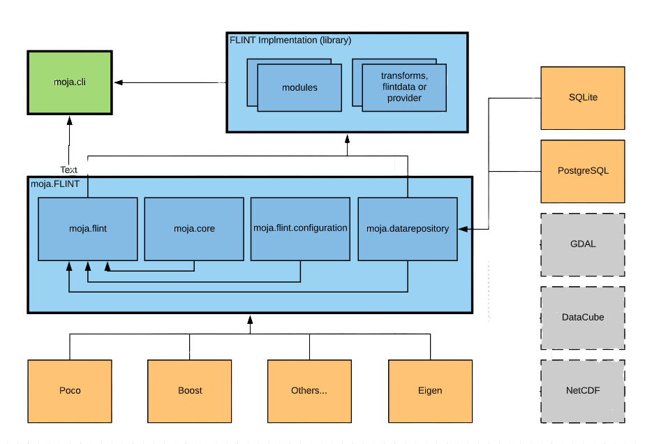
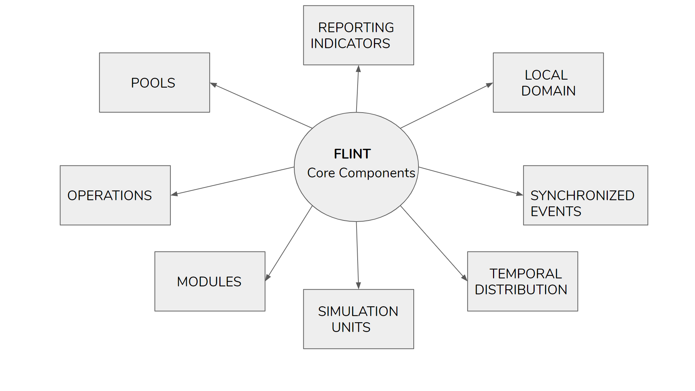

.. _DeveloperWorkflow:

FLINT Architecture
##################

FLINT is a fully modular and highly flexible open-source software that
allows users to integrate the carbon model(for estimating greenhouse gas
emission) and other models with remote sensing data to produce
greenhouse gas accounts for the land sector.

The overall framework will be based on the simulation of events and
processes. Key elements of the framework will include the overall
integration module, a transaction service, and individual modules that
are easily exchanged and modified, and that each serves key functions
such as the representation of growth, decomposition, disturbances,
forest management actions, and so on.

   High Level Design of FLINT

Core Components of FLINT System
-------------------------------

.. toctree::
  :maxdepth: 2

  pool
  operation
  modules
  simulation_units
  local_domain
  temporal_distribution
  reporting_indicator

   Core Components of FLINT System