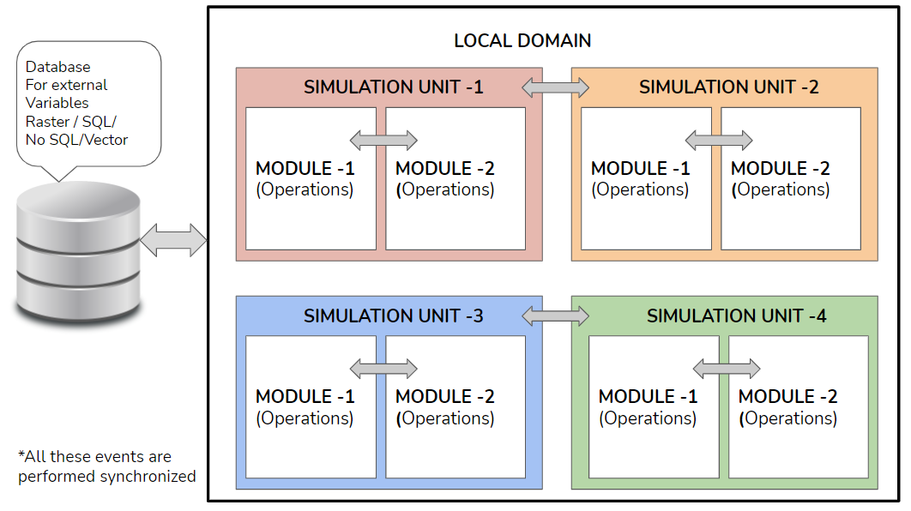

.. _DeveloperWorkflow:

Local Domain
==================
Above Simulation Units, is the Local Domain. The Local Domain is the
collection of Simulation Units that are bound for a specific purpose.
This can be, for example, to report on the changes in carbon stocks for
a particular region.

Within FLINT, Local Domains have three main functions:-

-  They are used to store the variable values for all the simulation
   units which they represent.
-  Through a Local Domain Controller they assign these values to the
   simulation units during a simulation.
-  They receive the outputs simulation units and update the domain characteristics.

