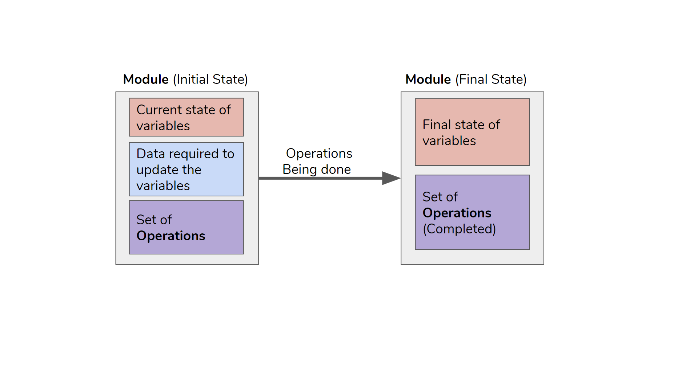

.. _DeveloperWorkflow:

Modules
=========

A module is a self-contained set of operations that determine the state of, or change in, variables across a specified period of time for a single Simulation Unit in direct response to event notifications from the FLINT core system (Unit Controller).

Each module reads information about the current state variables and the data required to update the state variables, such as climate data or information about disturbances to simulate. Each module then performs the required calculations and returns information about the updates to apply to each of the state variables and C pools.

