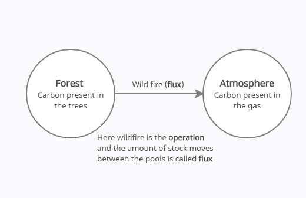

.. _DeveloperWorkflow:

Operation
=============

An operation is a process within the FLINT that moves carbon stock
between pools. FLINT uses operations to update the values for Simulation
Units and to record flux values in a flux table. For example, an
operation, reflecting plant growth can be applied to aboveground biomass
pools to estimate the growth flux.

