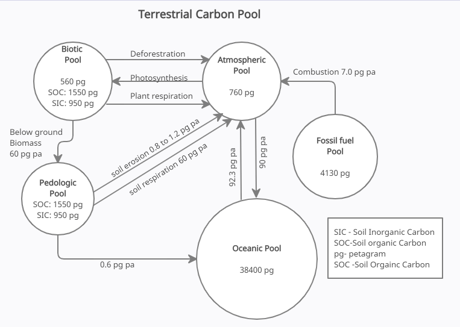

.. _DeveloperWorkflow:

Pools
=========

A pool is a reservoir within which something can be stored and released. For example, a carbon pool is a reservoir from which carbon can be stored or emitted, such as debris. Within FLINT, each pool has attributed a value, for example, tonnes carbon, and at each time step, the FLINT can move stores from one pool to another using operation.

   Terrestial Carbon Pool