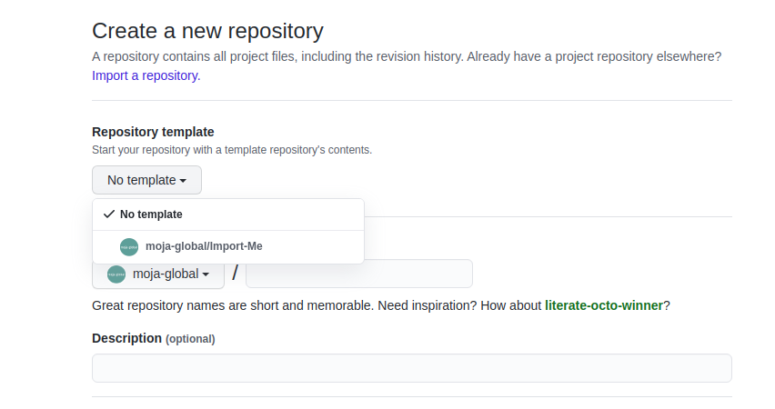
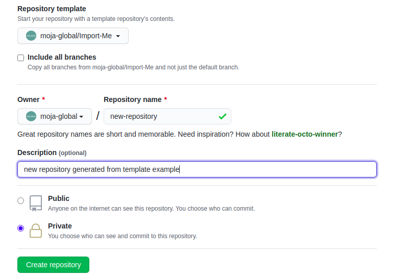
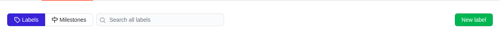
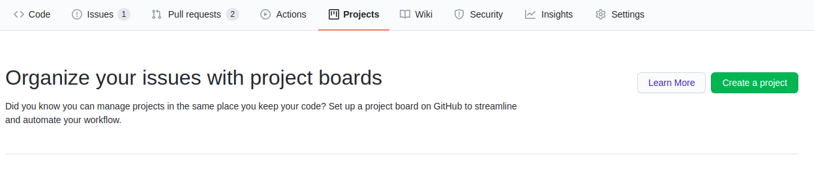
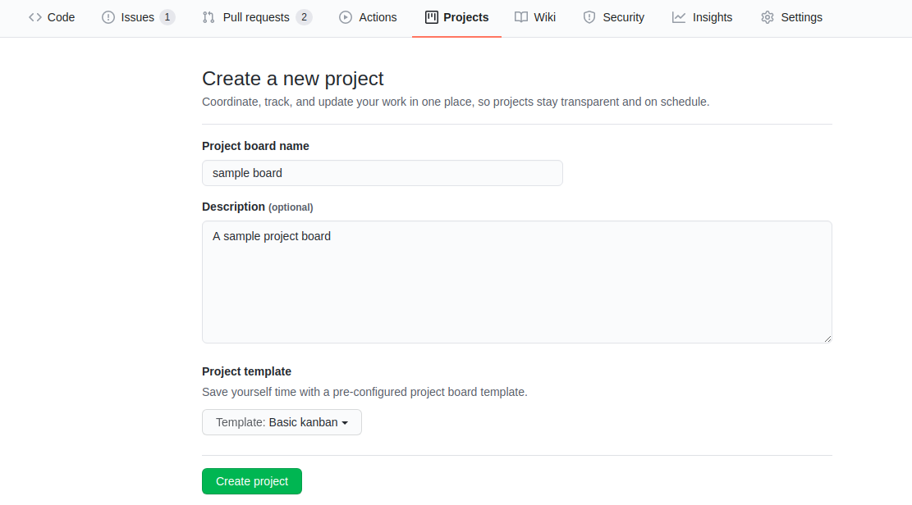
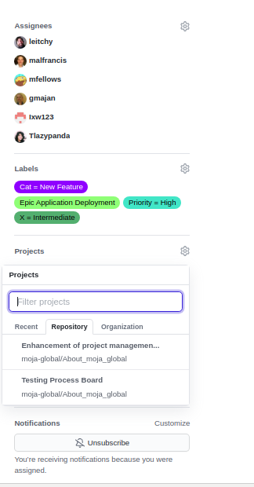
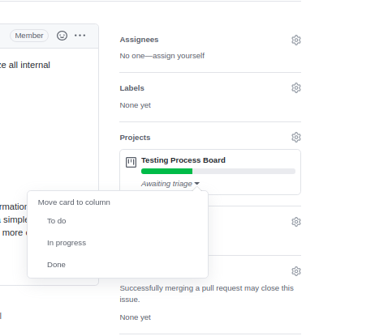
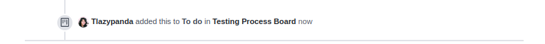
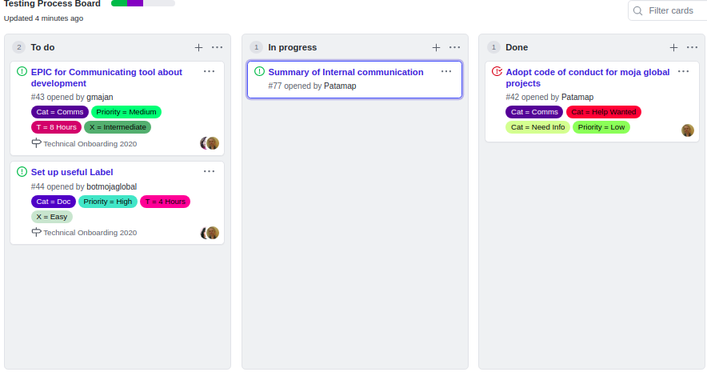
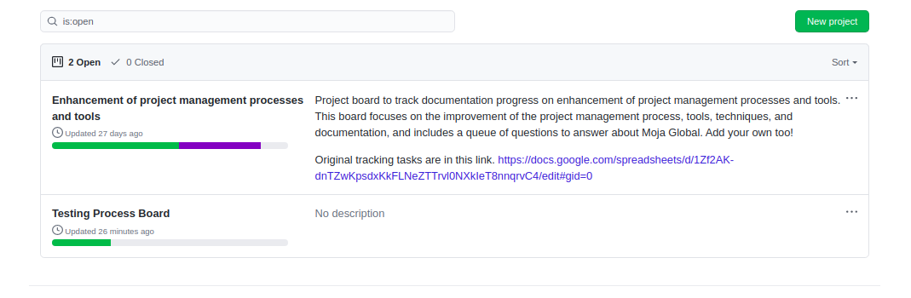

.. _DeveloperWorkflow:

GitHub Repository maintenance
#############################

This section guides contributors and maintainers on the guidelines to follow while setting up a new repository and maintaining it under moja global.

Repository Creation
===================

New repository under moja global is generated from the template repository `Import-me <https://github.com/moja-global/Import-Me>`_.
This ensures that  the start-up files for a standard moja global repo is already included in the new repository and the commit history also remains clean.

Follow these steps to generate your new repository from Template repository:

* Navigate to https://github.com/moja-global.
* Select the ``New`` button for new repository creation.
* On the create repository page, select the template ``Import-me`` from the dropdown titled ``Repository Template``.

* Upon selecting the template, please make sure the checkbox for ``include all branches`` is unmarked.

* Now go ahead and add details of your repository name,description and visibility setting (Public or Private).
* Click on the ``Create repository`` button as the final step!

Setting up Labels for your repository
=====================================

Labels are visual tools for the project. They make it easier to filter issues and prioritize tasks. Additionally, they also help new contributors identify areas of interest for your project.

They can help improve awareness of different types of contribution methods in the project. (e.g. science, communication and documentation tasks).

* Navigate to ``https://github.com/moja-global/<repository_name>/labels`` where ``<repository_name>`` is the name of the new repository created. You can find all the labels setup for your repository here. In order to create a new label, click on the New Label button.

* Configure each issues’ labels in a way that makes sense for your project. The labels should classify the issues/pull requests in an appropriate manner so they can be easily applied for filtering later. Every issue and pull request labels can be found under the Issue tab with the labels button.

moja global has the following labels available on an organisational level. You can use the labels depending on the issue, and make new labels specific to the repository, if needed as explained above.

It is recommended to provide every issue with 4 types of labels: 1 from each type of label below.

Category:

* ``Cat = Blocked`` = Progress on the issue is Blocked, either due to waiting for another code change, or not in control.
* ``Cat = Bug`` =  Something isn't working
* ``Cat = Comms`` =  Propose a way to better communicate a feature
* ``Cat = Doc`` = Adding or updating documentation
* ``Cat = Good for newcomers`` = These issues require minimal context and are well-suited for new contributors
* ``Cat = Feedback`` = Describe how we can improve your experience
* ``Cat = Help Wanted`` = Anybody out there, can you give me a hand?
* ``Cat = Need Info``
* ``Cat = New Feature`` = Suggest an idea for this project
* ``Cat = Science`` = Suggest how the science can be improved

Priority:

* ``Priority = High`` = High Priority issues/pull request that require immediate attention
* ``Priority = Low`` = Low Priority issues/pull request that require attention only after Mid Priority issues are resolved.
* ``Priority = Medium`` = Mid Priority issues/pull request that require attention after High Priority issues are resolved.

Time:

* ``T = 1 Hour`` = Resolving this issue will take about 1 hour
* ``T = 2 Hours`` = Resolving this issue will take about 2 hours
* ``T = 4 Hours`` = Resolving this issue will take about 1/2 day
* ``T = 8 Hours`` = Resolving this issue will take about 1 day
* ``T = Break me up`` = This issue takes more than 1 day and needs to be broken up into smaller tasks

Difficulty:

* ``X = Easy`` = This is a good issue for new contributors
* ``X = Intermediate`` = Solving this issue requires some experience
* ``X = VeryDifficult`` = Solving this issue requires advanced expertise

Creating and maintaining Project Boards
=======================================

Project boards on GitHub help you organize and prioritize your work by creating them for specific feature work, comprehensive roadmaps, or even release checklists.

There are 2 types of project boards available:

* Repository: Boards for use in a single repository.
* Organization: Boards for use in a GitHub organization across multiple repositories (but private to organization members)

Moja global team uses boards for development and documentation at the repository level. It means repository-specific boards for focused work in each repository.

Creating your first board
-------------------------

* Project boards can be found under the the ``Projects`` tab in the same row as Issues and Pull requests on a specific repository.

* If you have enough permissions on the repository or as an organisation member, then you'll be able to create a new project by clicking on the green button labeled ``Create Project``.

* Configure the name and description for the project board. You can also choose templates to set up basic columns and sorting for your board. Currently, moja global team selects ``Basic kanban`` for Kanban-style boards.

* After creating the project board, you may make adjustments to it as needed. You can create new columns, set up automation and add pre-existing GitHub issues and pull requests to the project board.

However, it is recommended that the contributors use the existing board in each repo rather than creating a new board unless necessary.

Adding issues/pull requests to your Project Board
-------------------------------------------------

After you set up a project board, you need to populate it with issues and pull requests and keep updating the board on a regular basis.

The ``Basic kanban`` template offers the following columns for every issue/pull request. You may classify your issues/pull requests into one of according to the criteria below.

  * Todo: Open issues/pull requests, Reopened issues/pull requests
  * In progress: Issues that have been assigned, pull requests that are open and reviewed
  * Done: Closed issues/pull requests, Merged pull requests

In order to add a issue/pull request to a project board, follow these steps:

* Navigate to the specific issue/pull request.
* Under the right sidebar, check out the ``Projects`` tab. Click on the settings icon next to the ``Projects`` tab and select the relevant project board. If the settings icon is not visible to you, then you don't have enough permissions to add an issue/pull request to a project board.

* After selection of the board, you may classify it into one of the three columns by clicking on the ``Awaiting Triage`` dropdown and selecting any one of the above options (Todo, In progress, Done).

* Once you have classified your issue/pull request into the correct column, you can see an update for the same shown in your issue.

* Now if you need to update the column, navigate to the Projects tab. You can then drag-and-drop issues/pull requests from one column to another as per your convenience.

Build project boards into your workflow
---------------------------------------

After you set up a project board and populate it with issues and pull requests, you need to integrate it into your workflow. Project boards are effective only when actively used.

The moja global team uses the project boards as a way to track our progress as a team, update external stakeholders on development, and estimate team bandwidth for reaching our milestones.

The following image shows how we can track progress with GitHub project boards.

As moja global is an open-source project and community, consider using the project boards to update other team members, and encourage participation inside of GitHub issues and pull requests.

In the meanwhile, we also consider using the project boards for development. It also helps remind us and other core contributors to spend 5 minutes each day updating progress as needed.
