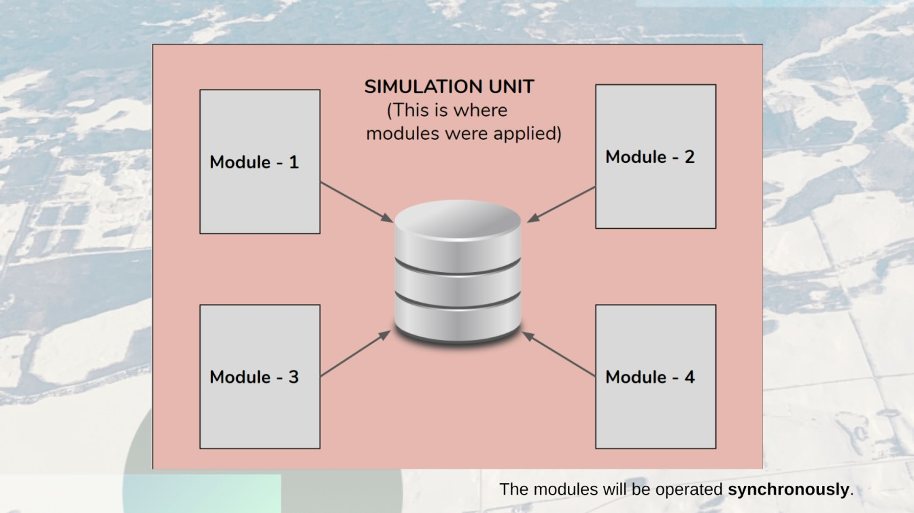

.. _DeveloperWorkflow:

Simulation Units
======================
A Simulation Unit is a unit where a module is applied. A Simulation Unit
can represent a spatial area, such as a pixel or ``forest stand``\ \_,
or it can represent an emissions source, such as livestock. Referring to
a geographically referenced region, the Simulation Unit is known as as a
Land Unit.

.. _forest stand: https://g.co/kgs/1K49wo

Within the databases and data layers, that are building blocks of the FLINT, there
are attribute values that describe the characteristics of each
Simulation Unit. For example, for a Land Unit, there may be information
on the unit’s area, land type, age of vegetation, species, and carbon
pools. The overall framework of FLINT manages the processing of
Simulation Units over time. While Simulation Units are the basis of all
simulations run in FLINT, they are rarely used for reporting purposes.

