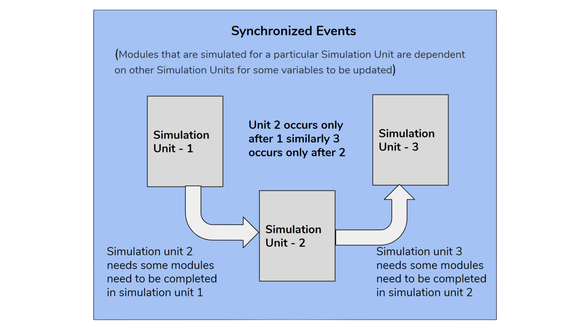

.. _DeveloperWorkflow:

Synchronized Events
======================

Modules are dependent on other Simulation Units. There is an
interdependence across the Simulation Units. So, a process is necessary
that synchronizes across the related Simulation Units.

FLINT included a synchronized server. This server uses a set of
user-inputted criteria to identify particular Simulation Units for which
a module will, or could, be applied. A module can be applied to all
Simulation Units that meet the criteria, or the module can be attributed
to a sub-set of the identified Simulation Units using pre-determined
criteria (e.g. randomly, weighted, or based on a unit characteristic).
Once identified, the module is run and the outputs computed. Notably,
this is carried out during the simulation.