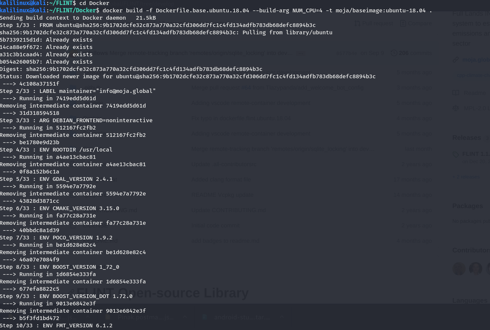
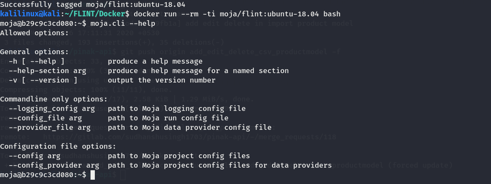

.. _DevelopmentSetup:

Docker Installation (for Mac and Linux Variants)
================================================

This section guides first-time contributors through installing FLINT
development environment through Docker on Mac and Linux systems.

Before proceeding further, make sure you have setup the project using
Git by following our `Git and GitHub Guide`_. Also make sure you have
the following prerequisites setup.

Prerequisites
=============

-  `Docker`_

Now that you have all the necessary prerequisites, you can proceed with
the Installation.

Setup Docker Container
======================

Containers are a simple way to build FLINT and all required
dependencies.

.. note::

   Before setting up, it is recommended to install the `FLINT.example`_
   repository first.

Building using prebuilt image
=============================

Instead of building the required libraries, pre-built Docker Image is
available for FLINT at our `Dockerhub`_ . You can pull and run FLINT
using this prebuilt image using the following commands.

::

   # pull the image
   docker pull mojaglobal/flint
   # run a container
   docker run --rm -ti mojaglobal/flint:latest bash
   # run CLI
   moja.cli --help

Alternatively, you can build the libraries by Building using the second
option below.

Building the containers
=======================

.. note::

   Please make sure that you have checked out to the ``Develop`` Branch
   for the FLINT Installation. You may refer to our `Git and GitHub
   Guide`_ for instructions on how to switch to develop branch.

The build has been split into two Dockerfiles, the first to get and
build required libraries. The second to get and build the moja FLINT
libraries and CLI program. :

::

   # working from the Docker folder "flint/tree/develop/Docker"

   # build the base
   docker build -f Dockerfile.base.ubuntu.18.04 --build-arg NUM_CPU=4 -t moja/baseimage:ubuntu-18.04 .

   Building the base libraries using Docker

:

::

   # build the flint container
   docker build  -f Dockerfile.flint.ubuntu.18.04 --build-arg NUM_CPU=4 --build-arg FLINT_BRANCH=develop -t moja/flint:ubuntu-18.04 .

   docker build  -f Dockerfile.flint.ubuntu.18.04 --build-arg NUM_CPU=4 --build-arg GITHUB_AT=XXXX --build-arg FLINT_BRANCH=develop -t moja/flint:ubuntu-18.04 .

.. figure:: ../images/installation_docker/step2b_f_docker.png
   :alt: Building the FLINT libraries using Docker
   :align: center
   :width: 600px

   Building the FLINT libraries using Docker

How to use the final container depends on the task. However, the
following command will bash into the flint container and allow you to
use the CLI program. :

::

   # run bash on the flint container
   docker run --rm -ti moja/flint:ubuntu-18.04 bash

Once in, you should be able to run the CLI program moja.cli :

::

   # run CLI
   moja.cli --help

   Running moja.cli using Docker

That should respond with the following options:

.. _Docker: https://docs.moja.global/en/latest/prerequisites/docker.html
.. _FLINT.example: https://docs.moja.global/en/latest/DevelopmentSetup/FLINT.example_installation.html
.. _Dockerhub: https://hub.docker.com/r/mojaglobal/flint
.. _Git and GitHub Guide: https://docs.moja.global/en/latest/DevelopmentSetup/git_and_github_guide.html#make-a-contribution

Allowed options
===============

::

   General options:
     -h [ --help ]          produce a help message
     --help-section arg     produce a help message for a named section
     -v [ --version ]       output the version number

   Commandline only options:
     --logging_config arg   path to Moja logging config file
     --config_file arg      path to Moja run config file
     --provider_file arg    path to Moja data provider config file

   Configuration file options:
     --config arg           path to Moja project config files
     --config_provider arg  path to Moja project config files for data providers

Docker Installation Video Tutorial
==================================

The above steps for installation of Docker can also be followed along
with the video tutorial:

.. raw:: html

  

  <iframe width="100%" height="100%" src="https://www.youtube.com/embed/eiCPhv-SRNc" title="FLINT Docker on Ubuntu 20.04" frameborder="0" allowfullscreen="" style="position:absolute; top:0; left: 0"></iframe>
  
