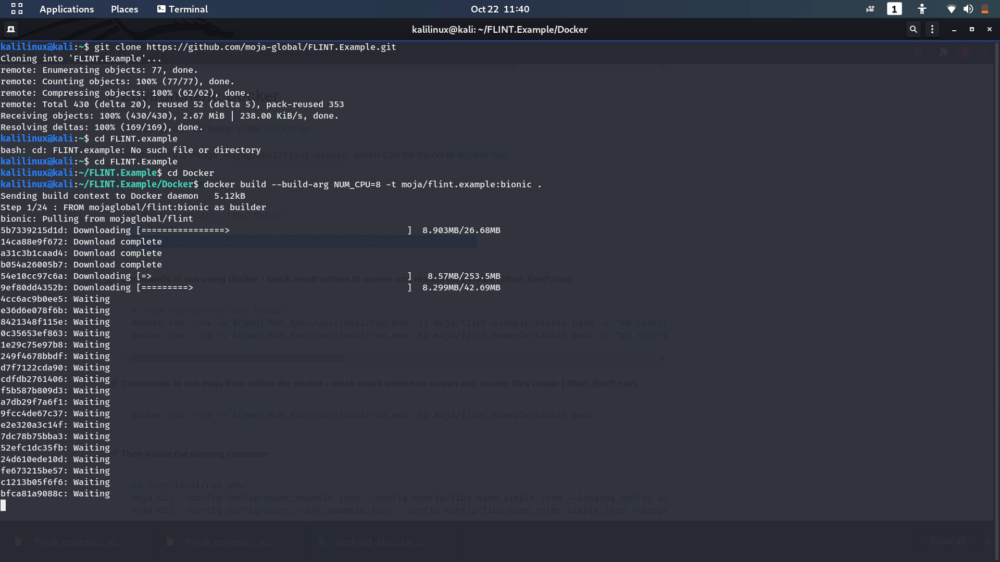
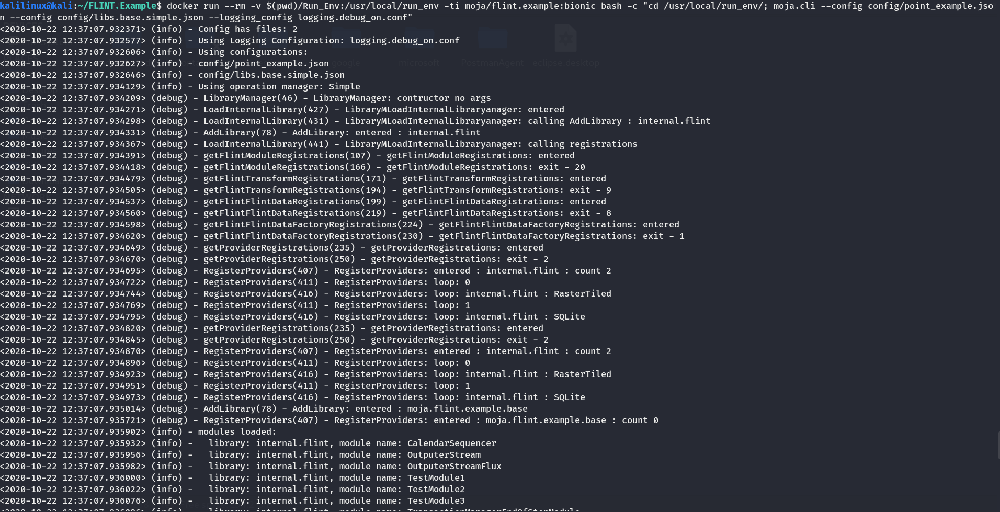
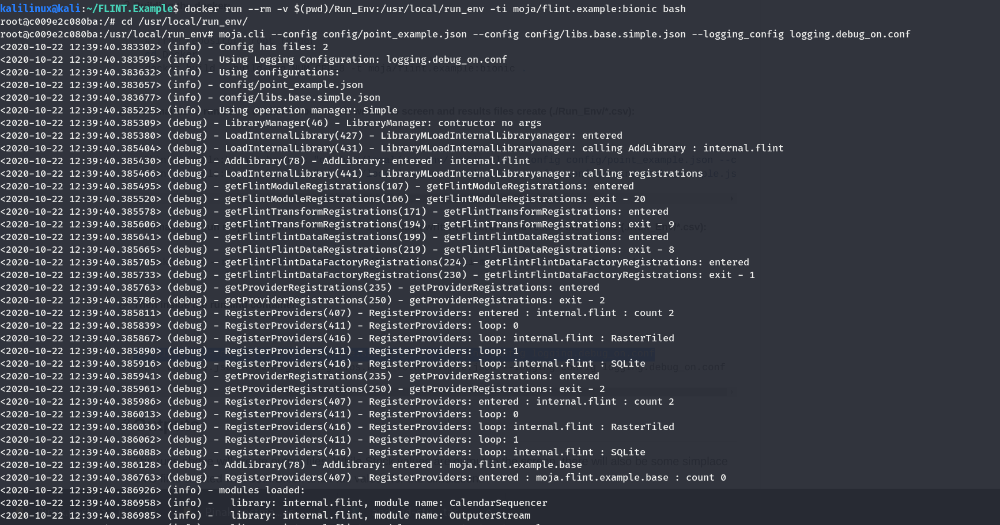
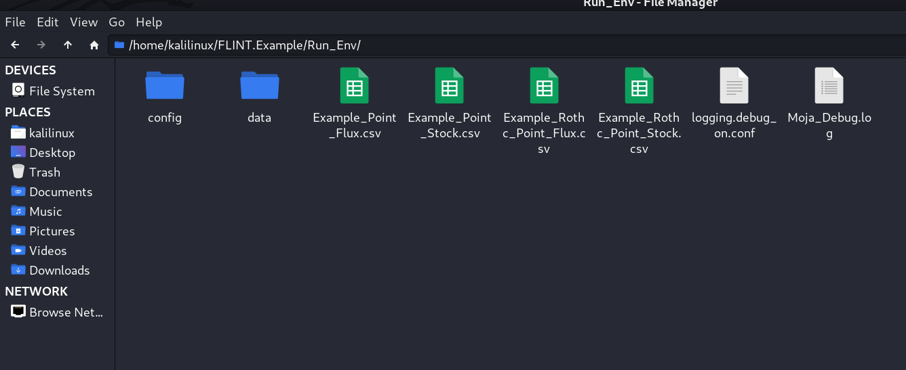

.. _DevelopmentSetup:

Environment: Docker
===================

In the Docker environment option for setting up FLINT.example, only the
run option is available. In case you want to develop or debug the
repository code, please switch to the Visual Studio environments.

Prerequisites
-------------

-  `Docker`_

Building the docker
-------------------

::

   # from repository root folder
   docker build --build-arg NUM_CPU=8 -t moja/flint.example:bionic .

-  Return to top level folder with ``cd ..``

   Building the FLINT.example image using Docker

Commands to run using docker - stock result written to screen and
results files create (./Run_Env/*.csv):

::

   # from repository root folder

   # For Linux
   docker run --rm -v $(pwd)/Run_Env:/usr/local/run_env -ti moja/flint.example:bionic bash -c "cd /usr/local/run_env/; moja.cli --config config/point_example.json --config config/libs.base.simple.json --logging_config logging.debug_on.conf"

   # For Windows
   docker run --rm -v %cd%/Run_Env:/usr/local/run_env -ti moja/flint.example:bionic bash -c "cd /usr/local/run_env/; moja.cli --config config/point_example.json --config config/libs.base.simple.json --logging_config logging.debug_on.conf"

For the RothC example, you may run this command:

::

   # For Linux
   docker run --rm -v $(pwd)/Run_Env:/usr/local/run_env -ti moja/flint.example:bionic bash -c "cd /usr/local/run_env/; moja.cli --config config/point_rothc_example.json --config config/libs.base_rothc.simple.json --logging_config logging.debug_on.conf"

   # For Windows
   docker run --rm -v %cd%/Run_Env:/usr/local/run_env -ti moja/flint.example:bionic bash -c "cd /usr/local/run_env/; moja.cli --config config/point_rothc_example.json --config config/libs.base_rothc.simple.json --logging_config logging.debug_on.conf"

   Running the examples using Docker

Commands to run moja from within the docker - stock result written to
screen and results files create (./Run_Env/*.csv):

::

   # For Linux
   docker run --rm -v $(pwd)/Run_Env:/usr/local/run_env -ti moja/flint.example:bionic bash

   # For Windows
   docker run --rm -v %cd%/Run_Env:/usr/local/run_env -ti moja/flint.example:bionic bash

Then inside the running container:

::

   cd /usr/local/run_env/
   moja.cli --config config/point_example.json --config config/libs.base.simple.json --logging_config logging.debug_on.conf
   moja.cli --config config/point_rothc_example.json --config config/libs.base_rothc.simple.json --logging_config logging.debug_on.conf

The Output files created are visible in the below screenshot:

   Running the moja.cli

   Output files created from runs

.. _Docker: https://docs.moja.global/en/latest/prerequisites/docker.html
