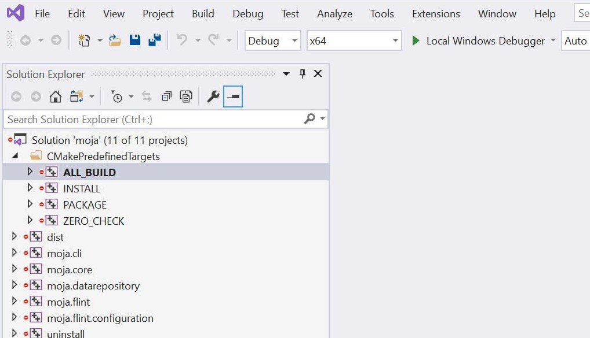
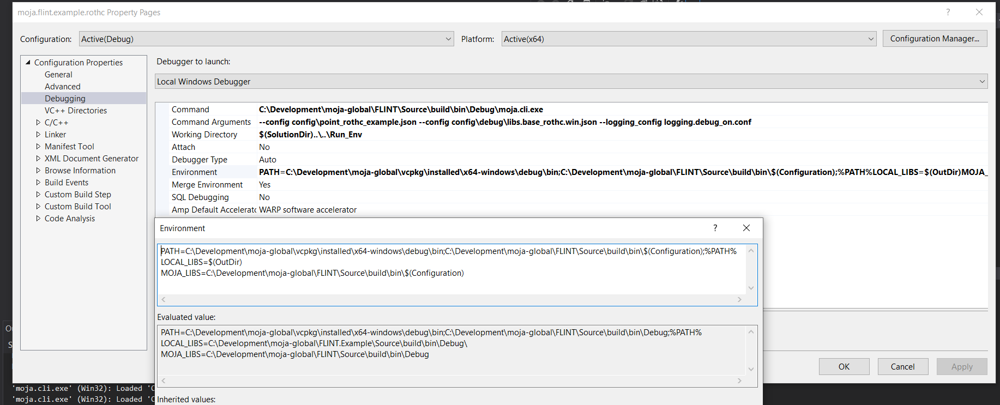
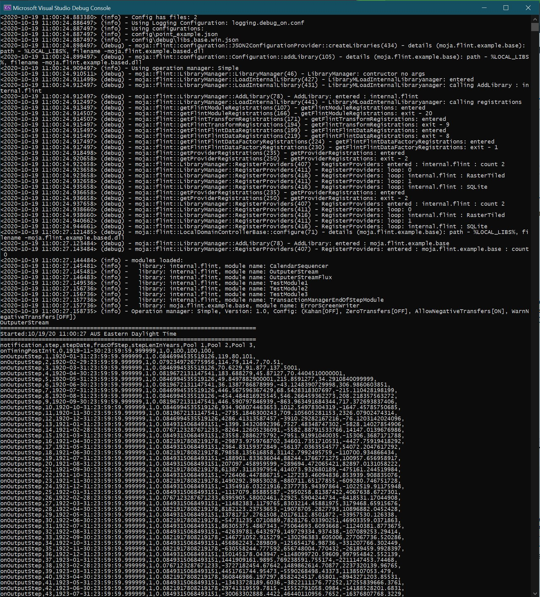
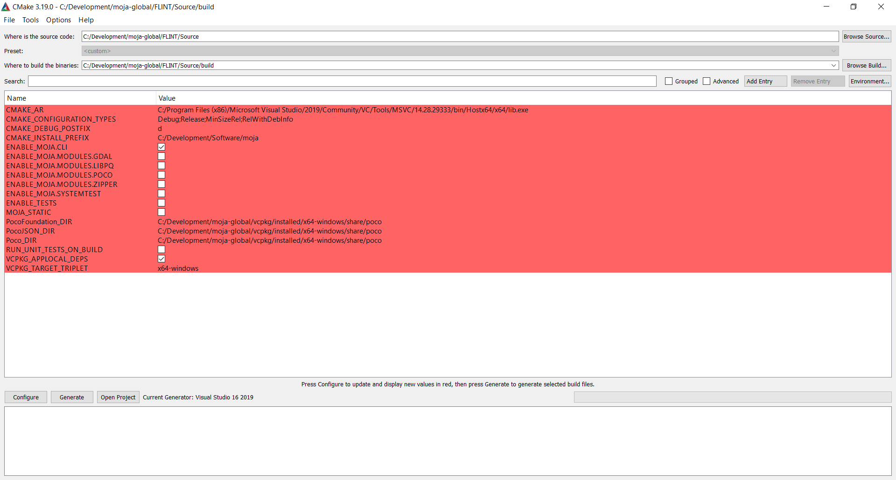
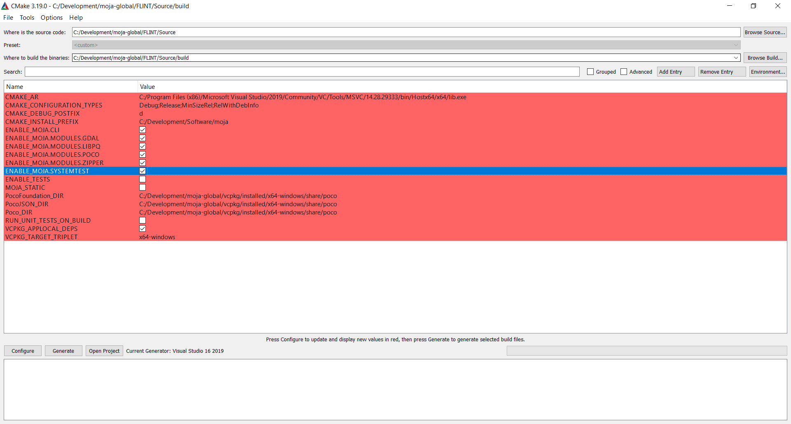
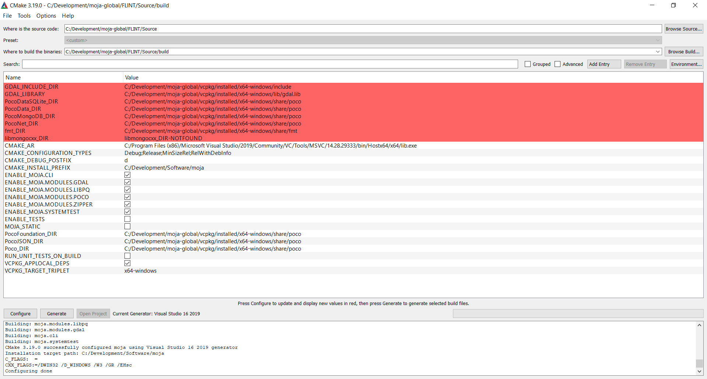
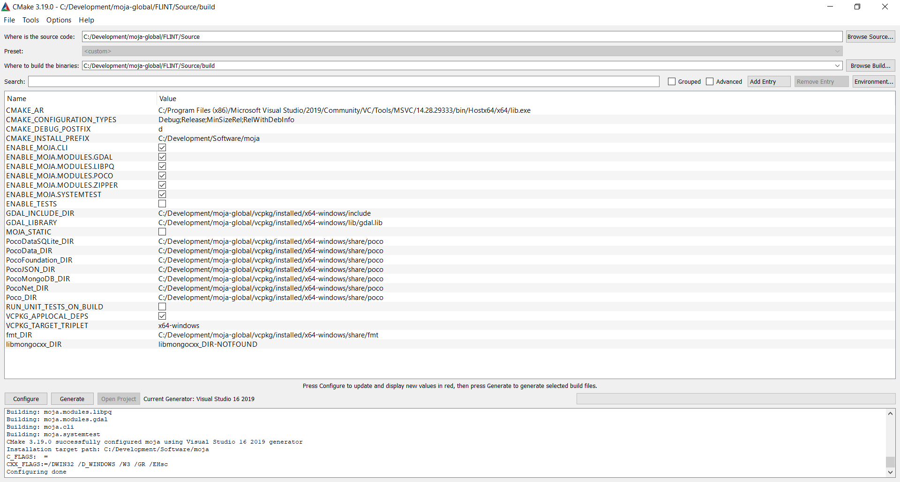
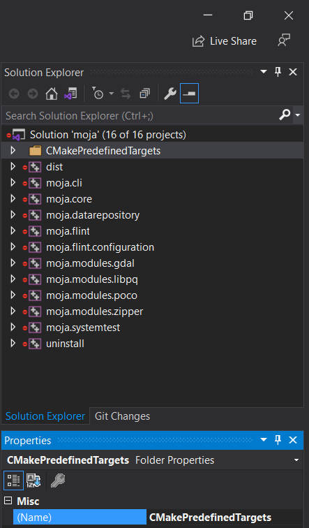
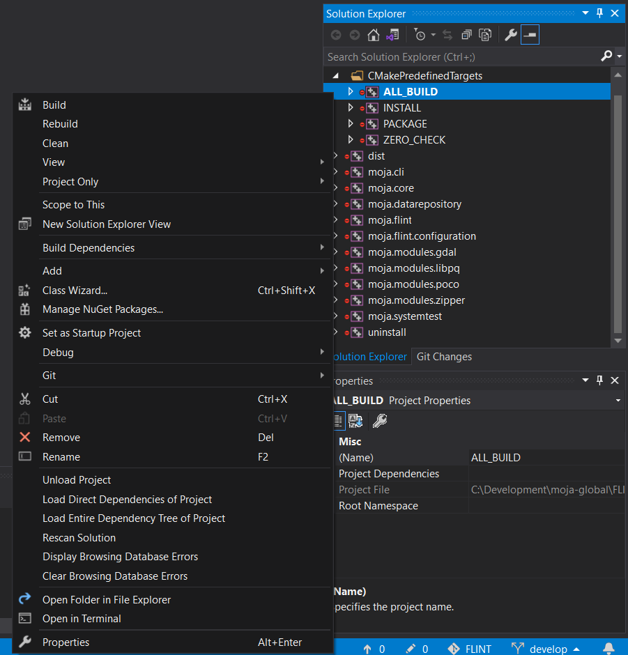

.. _DevelopmentSetup:

Environment: Visual Studio
==========================

In the Visual Studio environment option for setting up FLINT.example,
the options to run, develop and debug the repository code are available.
Also make sure you have the following prerequisites setup.

Prerequisites
-------------

-  `Cmake`_
-  `Visual Studio`_
-  `Docker`_
-  Forked and cloned `FLINT core repository`_
-  Forked and cloned `FLINT.example repository`_

Now that you have all the necessary prerequisites, you can proceed with
the Installation.

Using vcpkg to install required libraries
-----------------------------------------

Start ``cmd`` in the Vcpkg repository folder (that you had
cloned earlier) and use the following commands:

::

   # bootstrap
   bootstrap-vcpkg.bat

   # install packages
   vcpkg.exe install boost-test:x64-windows boost-program-options:x64-windows boost-log:x64-windows turtle:x64-windows zipper:x64-windows poco:x64-windows libpq:x64-windows gdal:x64-windows sqlite3:x64-windows boost-ublas:x64-windows fmt:x64-windows libpqxx:x64-windows

.. figure:: ../images/installation_vs2019_flint.example/Step1b.png
   :alt: Install required packages using vcpkg in ``cmd``
   :align: center
   :width: 600px

   Install required packages using vcpkg in ``cmd``.

Building the project
--------------------

Launch ``cmd`` and run the following commands:

::

   # Create a build folder under the Source folder
   cd Source
   mkdir build
   cd build

Now depending on which type of simulation you want to execute, you may
run one of the following generate commands:

Commands to run cmake for the point simulations:

::

   # Point simulations
   # Generate the project files
   cmake -G "Visual Studio 16 2019" -DCMAKE_INSTALL_PREFIX=C:\Development\Software\moja -DVCPKG_TARGET_TRIPLET=x64-windows -DOPENSSL_ROOT_DIR=c:\Development\moja-global\vcpkg\installed\x64-windows -DENABLE_TESTS=OFF -DCMAKE_TOOLCHAIN_FILE=c:\Development\moja-global\vcpkg\scripts\buildsystems\vcpkg.cmake ..

Commands to run cmake for the spatial simulations:

::

    # Spatial simulations
    # if your planning to run spatial chapman richards example you also need to enable the gdal module
    # Generate the project files
    cmake -G "Visual Studio 16 2019" -DCMAKE_INSTALL_PREFIX=C:\Development\Software\moja -DVCPKG_TARGET_TRIPLET=x64-windows -DOPENSSL_ROOT_DIR=c:\Development\moja-global\vcpkg\installed\x64-windows -DENABLE_TESTS=OFF -DENABLE_MOJA.MODULES.GDAL=ON -DCMAKE_TOOLCHAIN_FILE=c:\Development\moja-global\vcpkg\scripts\buildsystems\vcpkg.cmake ..

.. _Cmake: https://docs.moja.global/en/latest/prerequisites/cmake.html
.. _Visual Studio: https://docs.moja.global/en/latest/prerequisites/visual_studio.html
.. _Docker: https://docs.moja.global/en/latest/prerequisites/docker.html
.. _FLINT core repository: https://github.com/moja-global/FLINT
.. _FLINT.example repository: https://github.com/moja-global/FLINT.Example

Running the project
-------------------

In order to run and debug the Visual Studio solution -

-  Open the visual studio solution that CMake created at
   ``C:\Development\moja-global\FLINT\Source\build\moja.sln``
-  Build the debug configuration ``ALL_BUILD`` target by right-clicking
   the ``ALL_BUILD`` node and selecting ``Build``.

  Navigating to Visual Studio Debugging ``ALL_BUILD`` properties page

.. figure:: ../images/installation_vs2019_flint.example/Step4.png
  :width: 600
  :align: center
  :alt: Running ``moja.cli.exe`` in Visual Studio Debugging All properties page

  Running ``moja.cli.exe`` in Visual Studio Debugging All properties page

Running in the IDE and debugging is a little tricky. This could more
than likely be resolved with better cmake setups. But for now, there is
some setup that can make running and debugging work.

The issue is we want to run with the ``moja.cli.exe`` from the
moja.FLINT project, but debug in our current IDE (FLINT.example).

The solution is to use properties to set up a Debug run in the IDE,
making the command run ``moja.cli.exe``.

**NOTE**: All paths used below with ``C:\Development\moja-global`` will
need to be modified to match your system build location of the moja
project.

Test Module Example
-------------------

The settings required in VS2019 are:

::

   # Command
   C:\Development\moja-global\FLINT\Source\build\bin\$(Configuration)\moja.cli.exe

   # Command Args
   --config config\point_example.json --config config\$(Configuration)\libs.base.win.json  --logging_config logging.debug_on.conf

   # Working Directory
   $(SolutionDir)\..\..\Run_Env

   # Environment Debug
   PATH=C:\Development\moja-global\vcpkg\installed\x64-windows\debug\bin;C:\Development\moja-global\FLINT\Source\build\bin\$(Configuration);%PATH%
   LOCAL_LIBS=$(OutDir)
   MOJA_LIBS=C:\Development\moja-global\FLINT\Source\build\bin\$(Configuration)

   # Environment Release
   PATH=C:\Development\moja-global\vcpkg\installed\x64-windows\bin;C:\Development\moja-global\FLINT\Source\build\bin\$(Configuration);%PATH%
   LOCAL_LIBS=$(OutDir)
   MOJA_LIBS=C:\Development\moja-global\FLINT\Source\build\bin\$(Configuration)

**With Envs**: ``PATH`` for various libraries built in the Moja stage
and ``LOCAL_LIBS`` so we can modify the explicit path for our example
config to load libraries from this vs build (the default is the same
location as the EXE).

To match this, the example point config uses an environment variable in
the library path:

::

   {
     "Libraries": {
       "moja.flint.example.base": {
         "library": "moja.flint.example.based.dll",
         "path": "%LOCAL_LIBS%",
         "type": "external"
       }
     }
   }

RothC example
=============

We also have a RothC example for point level simulations. Inorder to run
this example, you may modify the following arguments in the above test
settings command arguments. These arguments will point at the right
configuration files for RothC. Please follow the following steps to set
the correct configuration -

-  Build the debug configuration ``ALL_BUILD`` target by right clicking
   the ``ALL_BUILD`` node and selecting ``Build``. Then right click the
   the ``moja.flint.example.rothc`` node and select
   ``Set as Startup Project`` then right click again and select
   properties. Navigate to Configuration ``Properties/Debugging``
   properties pane and configure the following:

   -  Command:
      ``C:\Development\moja-global\FLINT\Source\build\bin\Debug\moja.cli.exe``

   -  Command Arguments:

   ::

      --config config\point_rothc_example.json --config config\debug\libs.base_rothc.win.json --logging_config logging.debug_on.conf

   -  Working Directory: ``$(SolutionDir)..\..\Run_Env``

   -  Environment: :

   ::

      PATH=C:\Development\moja-global\vcpkg\installed\x64-windows\debug\bin;C:\Development\moja-global\FLINT\Source\build\bin\$(Configuration);%PATH%
      LOCAL_LIBS=$(OutDir)
          MOJA_LIBS=C:\Development\moja-global\FLINT\Source\build\bin\$(Configuration)

   ``ALL_BUILD`` properties page for ``moja.FLINT.example.rothc``

You should now be able to select ``Debug->Start Debugging`` to start a
debug run of the RothC example. You should see something like the
following:

   Debug run for rothc example

RothC model video tutorial
==========================

We also have a video tutorial dedicated to RothC model that can be
followed along with the commands -

.. raw:: html

   

   <iframe width="100%" height="100%" src="https://www.youtube.com/embed/Jfi2-vEhfkg" title="FLINT Example (RothC model) on Visual Studio" frameborder="0" allowfullscreen="" style="position:absolute; top:0; left: 0"></iframe>
   

Enable moja.modules.GDAL
========================

Before moving on to setting up the Chapman Richards model, we need to
enable the moja.modules.GDAL flags. We can toggle these flags by
clicking on ``BROWSE BUILD`` and setting it to the build directory where
we just built the solution.

-  Open the solution that CMake created at
   ``C:\Development\moja-global\FLINT\Source\build\moja.sln`` .

   Navigating to Cmake Configuration Page

-  Check the following Flags present:

..

   -  ENABLE_MOJA.MODULES.GDAL
   -  ENABLE_MOJA.MODULES.LIBPQ
   -  ENABLE_MOJA.MODULES.POCO
   -  ENABLE_MOJA.MODULES.ZIPPER

   Checking the flags mentioned

-  Now, Click on ``Configure`` option twice.

   Configuring the new options highlighted in red

-  Click on ``Generate`` and then you may explore all the enabled
   modules in Solution Explorer by clicking on ``Open Project``.

   Generating the new configuration

-  Open ``CMakePredefinedTargets``, right click on ``ALL_BUILD`` and
   click on Build

   Navigate to CMakePredefinedTargets Build

   CMakePredefinedTargets ``ALL_BUILD`` Screen

Viola! All libraries have been enabled You may now proceed with the
Chapman Richards example!

Chapman Richards example
========================

Based on the moja global repository `Chapman Richards`_ , this sample
can be run on both point and spatial versions (over Dominica). Inorder
to run this example, you may modify the following arguments in the above
test settings command arguments. These arguments will point at the right
configuration files for Chapman Richards.

::

   # Command Args
   # Point
   --config config/point_forest_config.json --config config/$(Configuration)/libs.gdal.chaprich.win.json
   # Spatial
   --config config/forest_config.json --config config/$(Configuration)/libs.gdal.chaprich.win.json --config_provider config/forest_provider.json

Chapman Richards model video tutorial
=====================================

We also have a video tutorial dedicated to Chapman Richards model that
can be followed along with the commands.

.. _Chapman Richards: https://github.com/moja-global/FLINT.Module.Chapman_Richards

.. raw:: html

  

  <iframe width="100%" height="100%" src="https://www.youtube.com/embed/JFTyeZQbPjI" title="FLINT Example (Chapman Richards model) on Visual Studio" frameborder="0" allowfullscreen="" style="position:absolute; top:0; left: 0"></iframe>
  

