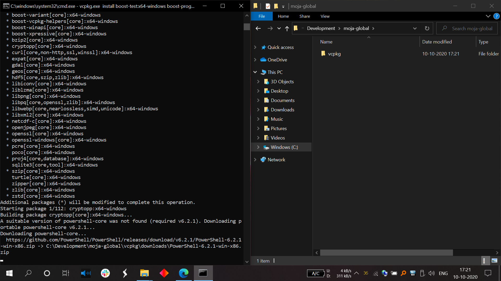
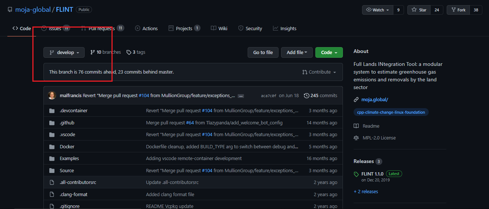
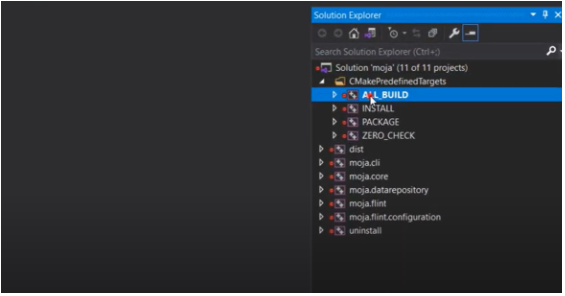
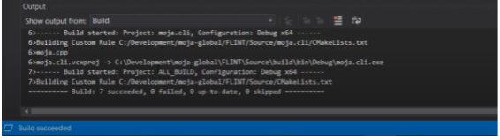
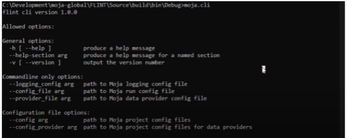
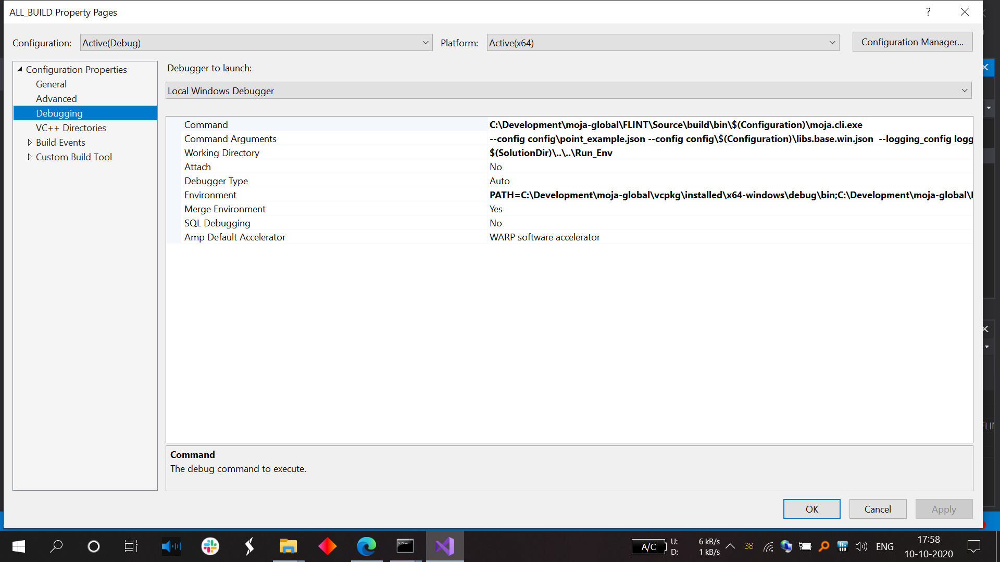

.. _DevelopmentSetup:

Windows Installation
====================

This section guides first-time contributors through installing FLINT
development environment.

Before proceeding further, make sure you have set up the project using
Git by following our guide `Git and GitHub Guide`_. Also make sure you
have the following prerequisites set up.

Prerequisites
-------------

-  `Cmake`_
-  `Visual Studio`_
-  `Vcpkg`_
.. -  Fork and clone the `FLINT core repository`_ in the Development/moja-global folder in your system.

Now that you have all the necessary prerequisites, you can proceed with
the Installation.

Using vcpkg to install required libraries
-----------------------------------------

Start ``cmd`` in the Vcpkg repository folder (that you had
cloned earlier) and use the following commands:

::

   # bootstrap
   bootstrap-vcpkg.bat

   # install packages
   vcpkg.exe install boost-test:x64-windows boost-program-options:x64-windows boost-log:x64-windows turtle:x64-windows zipper:x64-windows poco:x64-windows libpq:x64-windows gdal:x64-windows sqlite3:x64-windows boost-ublas:x64-windows fmt:x64-windows libpqxx:x64-windows

   Installing required packages using vcpkg in Command Prompt

Setting up the FLINT development environment
--------------------------------------------
- Clone the FLINT repository in the moja-global folder from `here <https://github.com/moja-global/FLINT>`_
- After cloning the FLINT repository, switch to ``develop`` branch.

   Develop Branch of FLINT

-  Start ``cmd`` in the FLINT folder of your system and run
   command:

::

   cd FLINT
   git checkout develop

Using CMake to build the project
--------------------------------

Start ``cmd`` in your FLINT core
repository folder. Now use the following commands to create the Visual
Studio solution:

::

   # Create a build folder under the Source folder
   cd Source
   mkdir build
   cd build

   # from ..\moja\FLINT\source\build
   # now create the Visual Studio Solution (2019)
   cmake -G "Visual Studio 16 2019" -DCMAKE_INSTALL_PREFIX=..\..\.. -DVCPKG_TARGET_TRIPLET=x64-windows -DENABLE_TESTS=OFF -DENABLE_MOJA.MODULES.ZIPPER=OFF -DCMAKE_TOOLCHAIN_FILE=..\..\..\vcpkg\scripts\buildsystems\vcpkg.cmake ..

   # OR Visual Studio Solution (2017)
   cmake -G "Visual Studio 15 2017" -DCMAKE_INSTALL_PREFIX=..\..\.. -DVCPKG_TARGET_TRIPLET=x64-windows -DENABLE_TESTS=OFF -DENABLE_MOJA.MODULES.ZIPPER=OFF -DCMAKE_TOOLCHAIN_FILE=..\..\..\vcpkg\scripts\buildsystems\vcpkg.cmake ..

.. note::

   All paths used below with ``C:\Development\moja-global`` need to
   be modified to match your system build location of the moja project.

.. _Git and GitHub Guide: https://docs.moja.global/en/latest/DevelopmentSetup/git_and_github_guide.html#make-a-contribution
.. _Cmake: https://docs.moja.global/en/latest/prerequisites/cmake.html
.. _Visual Studio: https://docs.moja.global/en/latest/prerequisites/visual_studio.html
.. _Vcpkg: https://docs.moja.global/en/latest/prerequisites/vcpkg.html
.. _FLINT core repository: https://github.com/moja-global/FLINT

Building the FLINT
===================

Run ``cmd`` and navigate to the build folder.

- Type ``moja.sln`` in the command prompt. Visual studio is launched.
- After Visual Studio has loaded completely, move to the Solution Explorer in the top right, expand the **CMakePredefinedTargets** and select **ALL_BUILD**.
- Right click on **ALL_BUILD** and click on **Build** in the menu.

   Solution Explorer in Visual Studio

- If the output says Build 7 succeeded as shown in the image below, FLINT has built successfully.

   Successful Build of FLINT
- To see the freshly compiled FLINT executable, open the build folder and in the command prompt type: ``cd bin\debug``.
- Type ``moja.cli`` in the command prompt.
- You see this output:

   Output after Successful FLINT run
Running the project
===================

  Running ``moja.cli.exe`` in Visual Studio Debugging All properties page

We are running the ``moja.cli.exe`` from the moja.FLINT project here. In
order to make edits to the Visual Studio Solution we can use the CMake
GUI.

Edit solution using CMake GUI
=============================

-  Launch the CMake GUI
-  In the ``Where to build the binaries`` field click ``Browse Build…``
   and select the folder you created above (i.e.
   ``C:\Development\moja-global\FLINT\Source\build``). The
   ``Where is the source code:`` field should update, if not, set it
   correctly.
-  You should be able to edit any CMake setting now (i.e. ENABLE flags
   like ``ENABLE_TESTS``), then click ``Configure`` – assuming all
   libraries and required software has been installed you should have no
   errors. Now click ``Generate`` and the Solution with adjustments
   should be ready to load into Visual Studio.

FLINT Core Installation Video Tutorial
======================================

The above steps for installation of FLINT on Windows with Visual Studio
can also be followed along with the video tutorial:

.. raw:: html

  

  <iframe width="100%" height="100%" src="https://www.youtube.com/embed/BmHltWrxCTY" title="FLINT Core on Visual Studio 2019" frameborder="0" allowfullscreen="" style="position:absolute; top:0; left: 0"></iframe>
  

