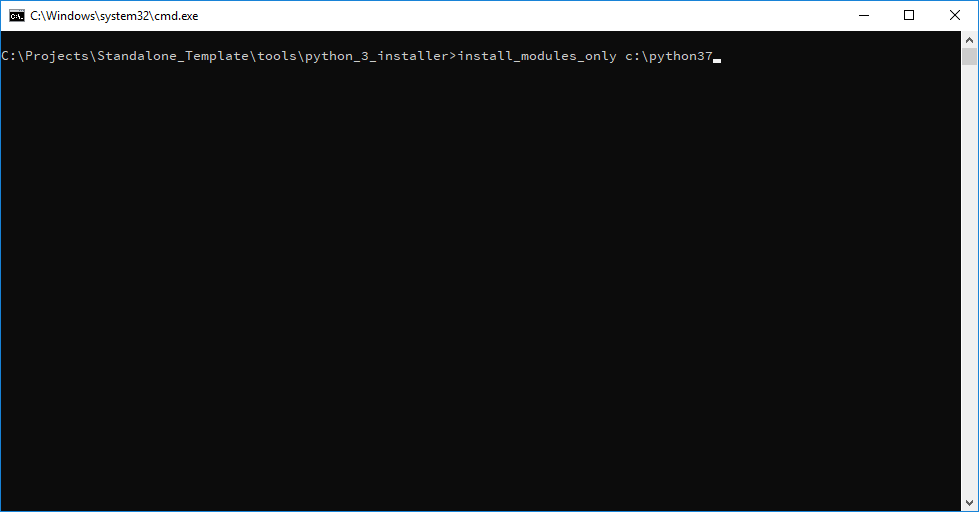
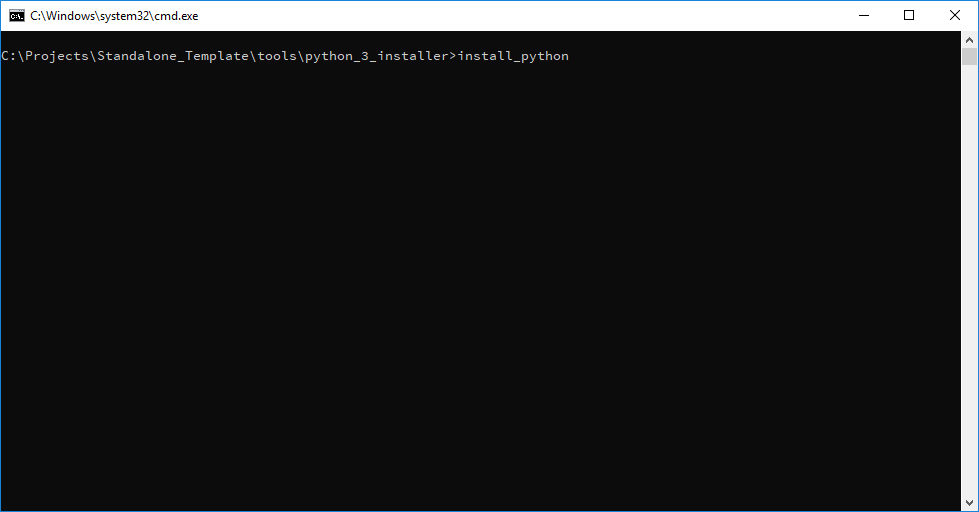
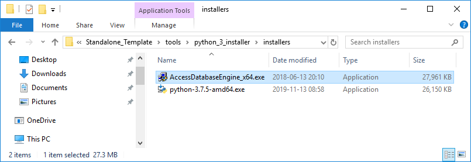
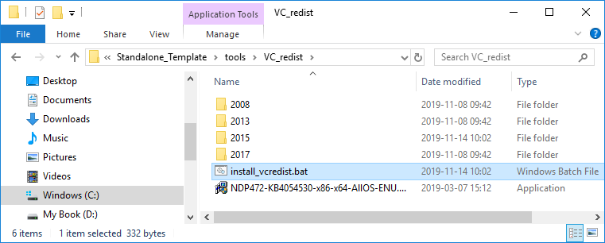

.. _GCBMDevelopmentSetup:

GCBM Prerequisites
==================

Before we take a leap into the process of development, please take a
moment to verify if you have the necessary tools setup and skills to get
started on this project. You should be familiar with the following:

Python 3.7
----------

This document will guide you through the steps for installing the Python
3.7 environment required for running the pre- and post-processing tools
for GCBM.

If you already have Python installed on your computer, follow the
instructions in the section `Existing Python Installation`_ .

If Python is not already installed, follow the instructions in the
section `New Python Installation`_ .

Existing Python Installation
~~~~~~~~~~~~~~~~~~~~~~~~~~~~

-  Locate your existing Python 3.7 installation (where python.exe is
   located). If you have both 32 and 64-bit versions installed (common
   with ArcGIS), find the path to the 64-bit version.
-  From a terminal in the ``python_3_installer`` directory, type:
   ``install_modules_only <python path>``

   Setting up modules for Existing Python Installation

New Python Installation
~~~~~~~~~~~~~~~~~~~~~~~

-  Verify that you have no existing Python 3.7 installation – it is not
   usually possible to install the same version in two different
   locations.
-  From a terminal in the ``python_3_installer`` directory, type:
   ``install_python [optional install path]``

   Setting up Python and modules for New Python Installation

Microsoft Access Database Driver
--------------------------------

You may choose to skip this section if you have Microsoft Access
installed.

If you do not have Microsoft Access installed, you will need to install
a driver to connect to this type of database.

-  Double-click
   ``python_3_installer\installers\AccessDatabaseEngine_x64.exe``

   Installing Microsoft Access Database Driver

Visual C++ Redistributable Packages
-----------------------------------

Install the C++ packages required to run GCBM and supporting tools:

-  Double-click ``tools\VC_redist\install_vcredist.bat``

  Installing the C++ packages required to run GCBM and supporting tools

GCBM Video Tutorial
-------------------

The above steps for installation of GCBM can also be followed along with
the video tutorial:

.. _Existing Python Installation: #id1
.. _New Python Installation: #id2

.. raw:: html

  

  <iframe width="100%" height="100%" src="https://www.youtube.com/embed/pSfUlDk37Jk" title="Test GCBM using the Training Package" frameborder="0" allowfullscreen="" style="position:absolute; top:0; left: 0"></iframe>
  

