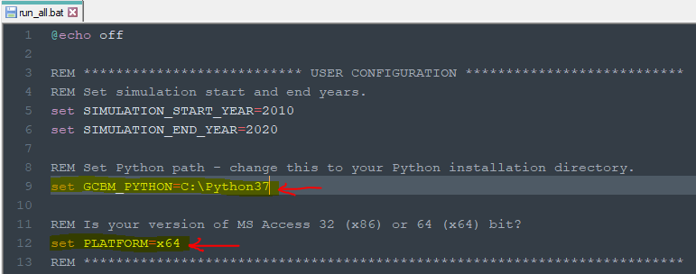
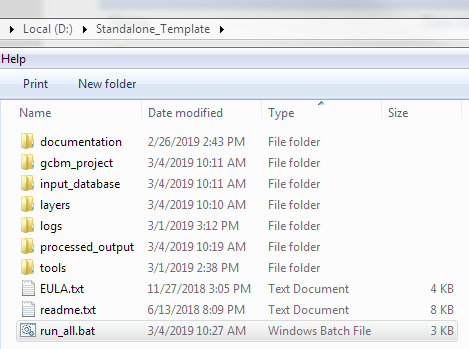

.. _GCBMDevelopmentSetup:

Windows Installation
####################

This section guides first-time contributors through installing GCBM on Windows.

Before proceeding further, make sure you have the following prerequisites setup:

Prerequisites
-------------
The prerequisites are:
* Python 3.7
* Microsoft Access Database Driver
* Visual C++ Redistributable Packages
You can view the details of the prerequisites `here. <https://docs.moja.global/en/master/GCBMDevelopmentSetup/prerequisites.html>`_

Now that you have all the necessary prerequisites, you can proceed with the Installation.

Update GCBM Run Script
----------------------

Edit ``run_all.bat`` and update the Python path to the one used in the Python installation step, and the platform bit-ness to match your version of MS Access if needed:

  Editing ``run_all.bat`` file to update Python path and Platform

Test GCBM
---------

Double-click the ``run_gcbm.bat`` file to run GCBM – if the installation steps were performed correctly, the preprocessing tools, GCBM model, and postprocessing tools should run without any error messages.

  Running the ``run_gcbm.bat`` file to execute GCBM

Viola! We are all done.

GCBM Video Tutorial
-------------------

The above steps for installation of GCBM can also be followed along with the video tutorial:

.. raw:: html 

  

  <iframe width="100%" height="100%" src="https://www.youtube.com/embed/pSfUlDk37Jk" title="Test GCBM using the Training Package" frameborder="0" allowfullscreen="" style="position:absolute; top:0; left: 0"></iframe>
  
