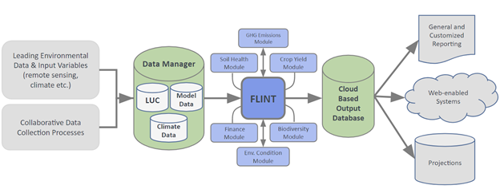

Understanding FLINT
======================

Countries recognise the importance of improving decision making and
supporting land sector policies to reduce greenhouse gas (GHG) emissions
and increase removals. At the same time, there is heightened attention
globally on transparency in climate action to support the goals of the
Paris Agreement and in supporting transitions to achieve the Sustainable
Development Goals. The Full Lands Integration Tool (FLINT) is an
open-source platform to estimate emissions and removals of greenhouse
gases from the land sector using modules that perform specific analyses
of carbon flows.

The FLINT is a second-generation tool aimed to facilitate the
implementation and operation of land sector emissions estimation systems
worldwide. It was developed through cooperation between Kenya, Australia
and Canada and incorporates lessons learned from the development of the
CBM-CFS3 (Canada) and FullCAM (Australia). Some core features are:

-  A full-mass balance framework able to meet all IPCC requirements.
-  Possibilities for customisation to meet national policy and reporting
   requirements.
-  A modular system that allows the use of individual and exchangeable
   modules.
-  Ability to operate in a spatially explicit way.
-  Ability to produce fine resolution time series data.
-  Ability to report on the past and to generate projections.
-  Flexibility for representing all land uses.
-  Providing a framework for continuous improvement.
-  Open-source software managed by moja global under the Linux
   Foundation.

The FLINT provides a framework to progressively develop MRV-related
systems, data and capacities. By this means, countries can start with
simple implementations using existing global data sets (Tier 1) and then
gradually move to more complex calculation approaches, using national
and regional information (Tier 2 or 3).

The basic role of the FLINT is to coordinate the interaction of data
(e.g. spatial data, non-spatial data, carbon pools, variables, fluxes)
and modules. It also manages computational outputs. FLINT-compatible
modules are discreet software packages that can be attached to the
FLINT. It is possible to differentiate between calculation modules and
functionality modules. Calculation modules can change the state of
variables and pools for pixels over a sequence of steps. Functionality
modules do not apply changes to variables or pools but affect the
utility of the FLINT by e.g. aggregating data or generating outputs.

A unique configuration of modules attached to the FLINT is referred to
as implementation (described in the picture below). Existing FLINT
implementations are SLEEK-FLINT, GCBM and FLINTpro. SLEEK-FLINT uses the
Chapman-Richards function as the basis of one of it’s forest growth
models. GCBM uses growth-and-yield curves that describe the relationship
between stand age and stand volume.

Contents:

.. toctree::
  :maxdepth: 1

  moja-flint/index
  data-preparation/index
  science/index
