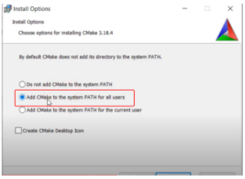

.. _prerequisites:

Cmake Installation
==================

CMake is required to build the FLINT from its source code on Windows.
CMake is an open-source family of tools designed to build, test and
package software.

-  Please download and install the latest binary distribution of CMake
   for your platform from `here. <https://cmake.org/download/>`__

On opening the installer: 

- Open the installer, click **Next**. 
- Accept the terms and click **Next**.

   License Page of CMake
- Select the **Add CMake to the system PATH for all users** option in the Install options section. 

   Install Page of CMake
- Click **Next** and finally click **Install**
- After CMake is installed, restart your system.
