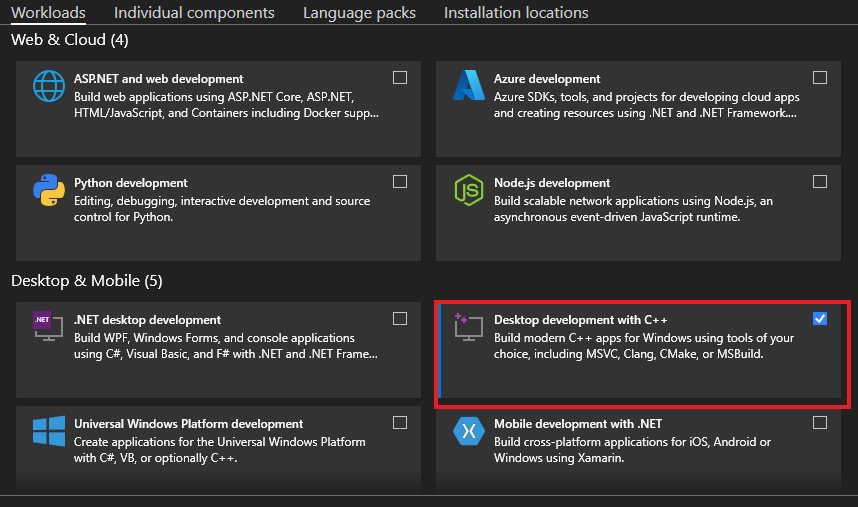
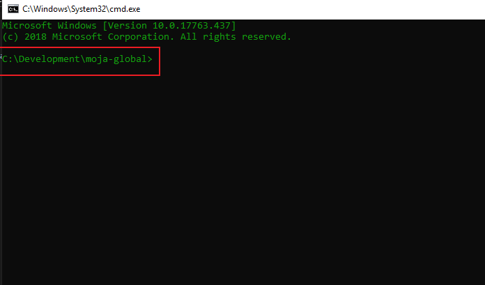

.. _prerequisites:

Visual Studio Installation
==========================

Building FLINT requires a C++ compiler. On Windows, it is recommended to
use the Visual Studio IDE which includes a C++ compiler and several
other useful tool. You can either install the Visual Studio 2019 or the
Visual Studio 2017 variant.

Please follow these steps for a smooth installation:

For Visual Studio 2019
----------------------

-  Navigate to https://visualstudio.microsoft.com/downloads/
-  Select the community version download button.
-  If you don’t have a Visual Studio Subscription, you can create one
   for free by clicking on “Create a new Microsoft account” on the login
   page.
-  Follow the steps prompted by the installer.

After launching the Visual Studio installer:

-  Select the desktop development with C++ workload and make sure it is
   checked.
-  Make sure the **Install while downloading** option is selected for
   faster installation.
-  Click on **Install**

   Install Section of Visual Studio 2019

After the installation is complete:

-  Restart your system.
-  Create a folder inside ``C`` Drive and name it ``Development``.
-  Inside the ``Development`` folder create a folder and name it
   ``moja-global``
-  Using ``cmd``, open the ``moja-global`` folder.

   Folder Path In `cmd`

For Visual Studio 2017
----------------------

-  Navigate to https://visualstudio.microsoft.com/vs/older-downloads/
-  Expand the 2017 version and click on the download button.
-  If you don’t have a Visual Studio Subscription, you can create one
   for free by clicking on “Create a new Microsoft account” on the login
   page.
-  Follow the steps prompted by the installer.
